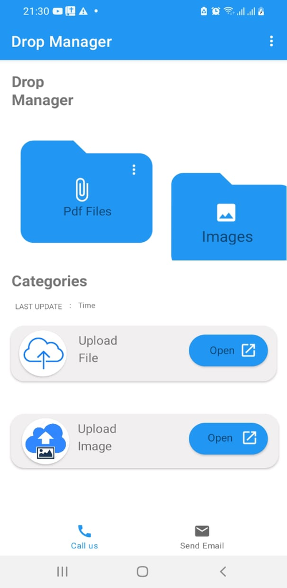
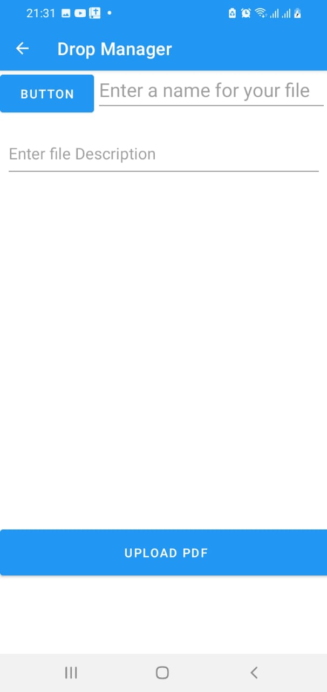
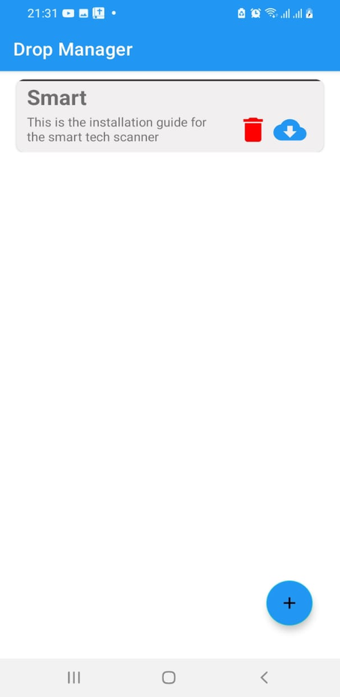

# FileUploads
A mobile application that helps  you to upload your files remotely for easy and convient access

## Description
The file uploads is a mobile applictaion build on purely java language. It comprises of firebsae authentication that allows users to create their accounts and there after loggin in. They can upload their files and images on firebase cloud, view them online or download them locally.

#### By **[JOSEPH MAINA](https://github.com/JOSEPHMAINA1995)**

## Prerequisite
* A complete Laptop or desktop machine installed any operating system of your choise
* Internet connection for stable working environment
* Android studio
* Emulator or an android mobile device
* JDK	

## Features

* User Authenticating using firbse
* Uploading images and files
* Viewing and downloading the files and images at your personal convinience

## Known Bugs
The application breaks when one omits to edit the image profile. (PLEASE DONT FORGET THIS PART). I am working to resolve this error.

## Credentials
* I have created a user for easy access to the app:
* Email: johndoe@gmail.com
* Password: 123456

## Technologies Used

* android studio
* Java
* XML for designing the frontend
* Firebase

### License

MIT License
Permission is hereby granted, free of charge, to any person obtaining a copy
of this software and associated documentation files (the "Software"), to deal
in the Software without restriction, including without limitation the rights
to use, copy, modify, merge, publish, distribute, sublicense, and/or sell
copies of the Software, and to permit persons to whom the Software is
furnished to do so, subject to the following conditions:

The above copyright notice and this permission notice shall be included in all
copies or substantial portions of the Software.

THE SOFTWARE IS PROVIDED "AS IS", WITHOUT WARRANTY OF ANY KIND, EXPRESS OR
IMPLIED, INCLUDING BUT NOT LIMITED TO THE WARRANTIES OF MERCHANTABILITY,
FITNESS FOR A PARTICULAR PURPOSE AND NONINFRINGEMENT. IN NO EVENT SHALL THE
AUTHORS OR COPYRIGHT HOLDERS BE LIABLE FOR ANY CLAIM, DAMAGES OR OTHER
LIABILITY, WHETHER IN AN ACTION OF CONTRACT, TORT OR OTHERWISE, ARISING FROM,
OUT OF OR IN CONNECTION WITH THE SOFTWARE OR THE USE OR OTHER DEALINGS IN THE
SOFTWARE. 

Copyright (c) 2022 **[JOSEPH MAINA](https://github.com/JOSEPHMAINA1995)**
